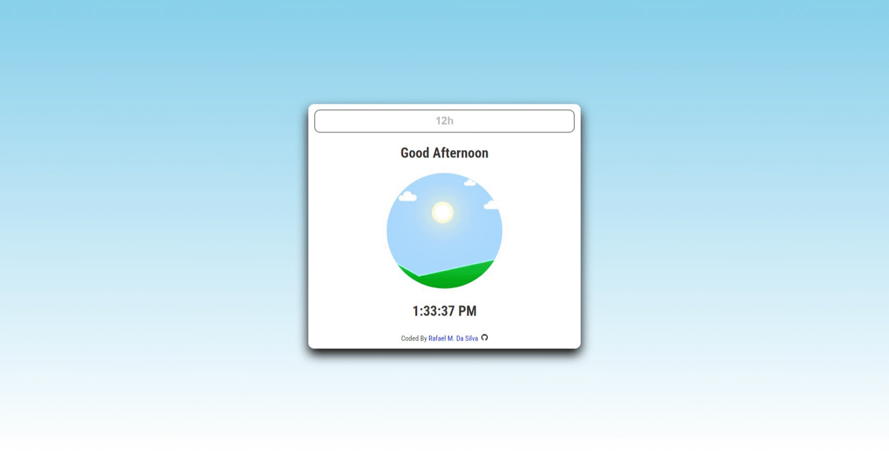

## Current Time

Shows the system time on a 12h format with a toggle button for 24h, followed by a greet, changing the page elements accordingly

### Features

- Displays the system time on a 12h format, followed by a greet
- Changes the page elements accordingly

### To-Do

- ~~Display minutes and seconds~~
- ~~Have the clock run in real time~~
- ~~Have a 24h/12h toggle~~
- Responsive design
- Further code optimization

### Live Demo

### Contributions

Feel free to make any suggestions by creating an issue.
